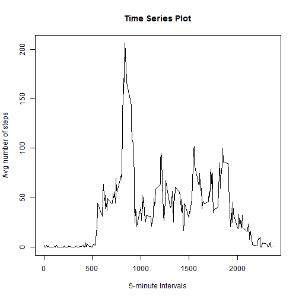

Loading and preprocessing the data

```r
unzip(zipfile="repdata%2Fdata%2Factivity.zip")
activityData <- read.csv("activity.csv")
```
What is mean total number of steps taken per day?
1. Calculate the total number of steps taken per day

```r
totalStepsPerDay <- tapply(activityData$steps, activityData$date, FUN=sum, na.rm=TRUE)
```
2. Make a histogram of the total number of steps taken each day

```r
hist(totalStepsPerDay, main=paste("Histogram of Total number of steps taken each day"),xlab="Total number of steps", ylab="Interval")
```


3. Calculate and report the mean and median of the total number of steps taken per day

```r
mean(totalStepsPerDay, na.rm=TRUE)
```

```
## [1] 9354.23
```

```r
median(totalStepsPerDay, na.rm=TRUE)
```

```
## [1] 10395
```
What is the average daily activity pattern?
1. Make a time series plot (i.e. type = "l") of the 5-minute interval (x-axis) 
and the average number of steps taken, averaged across all days (y-axis)

```r
avgStepsPerInterval <- tapply(activityData$steps,activityData$interval, FUN=mean, na.rm=TRUE)
library(ggplot2)
plot(names(avgStepsPerInterval), avgStepsPerInterval, type="l", main = "Time Series Plot", xlab="5-minute Intervals", ylab="Avg number of steps")
```


2. Which 5-minute interval, on average across all the days in the dataset, contains the maximum number of steps?

```r
print(paste0("Interval ", as.numeric(names(which.max(avgStepsPerInterval))) , " contains the maximum number of steps."))
```

```
## [1] "Interval 835 contains the maximum number of steps."
```
Imputing missing values
1. Calculate and report the total number of missing values in the dataset (i.e. the total number of rows with NAs)

```r
rowNA <- is.na(activityData$steps)
print(paste0("The total number of missing values in the dataset is: ", sum(as.numeric(rowNA))))
```

```
## [1] "The total number of missing values in the dataset is: 2304"
```
2. Devise a strategy for filling in all of the missing values in the dataset.
Calculate the mean number of steps per time interval

```r
meanInterval <-tapply(activityData$steps, activityData$interval, FUN=mean, na.rm=TRUE)
```
3. Create a new dataset that is equal to the original dataset but with the missing data filled in.

```r
activityDataNew <- activityData
```
loop through the index of NA rows in the activityDataNew dataset to replace NAs with the mean 
for 288 unique intervals in the dataset

```r
for (i in which(is.na(activityDataNew)))
{
      activityDataNew[i,1] <- meanInterval[((i-1)%%288)+1]
}
```
4. Make a histogram of the total number of steps taken each day 

```r
totalStepsPerDay <- tapply(activityDataNew$steps, activityDataNew$date, FUN=sum)
hist(totalStepsPerDay, main=paste("Histogram of Total daily number of steps"),xlab="Total number of steps", ylab="Interval")
```


Calculate and report the mean and median total number of steps taken per day.

```r
meanStepsPerDay <- mean(tapply(activityDataNew$steps, activityDataNew$date, FUN=sum))
medianStepsPerDay <- median(tapply(activityDataNew$steps,activityDataNew$date, FUN=sum))
print(paste0("The Mean of total number of steps taken per day is: ", meanStepsPerDay))
```

```
## [1] "The Mean of total number of steps taken per day is: 10766.1886792453"
```

```r
print(paste0("The Median of total number of steps taken per day is: ", medianStepsPerDay))
```

```
## [1] "The Median of total number of steps taken per day is: 10766.1886792453"
```
Do these values differ from the estimates from the first part of the assignment? 

```r
print(paste0("No, they are the same."))
```

```
## [1] "No, they are the same."
```
What is the impact of imputing missing data on the estimates of the total daily number of steps?

```r
print(paste0("Imputing missing data for missing data increased the total daily number of steps."))
```

```
## [1] "Imputing missing data for missing data increased the total daily number of steps."
```

Are there differences in activity patterns between weekdays and weekends?
1. Create a new factor variable in the dataset with two levels - "weekday" and "weekend" 
indicating whether a given date is a weekday or weekend day.

```r
dayOfWeek <- function(date) 
{
    if (weekdays(date) %in% c("Saturday", "Sunday")) return("weekend")
    else return("weekday") 
}
activityDataNew$dayOfWk <- sapply(as.Date(activityDataNew$date), FUN=dayOfWeek)
```
2. Make a panel plot containing a time series plot (i.e. type = "l") of the 5-minute interval (x-axis) 
and the average number of steps taken, averaged across all weekday days or weekend days (y-axis). 

```r
avgStepsPerDay <- aggregate(steps ~ interval + dayOfWk, data=activityDataNew, FUN=mean)
library(ggplot2)
ggplot(avgStepsPerDay, aes(interval, steps)) + geom_line() + facet_grid(dayOfWk ~ .) +
      xlab("5-minute interval") + ylab("Average number of steps")
```


